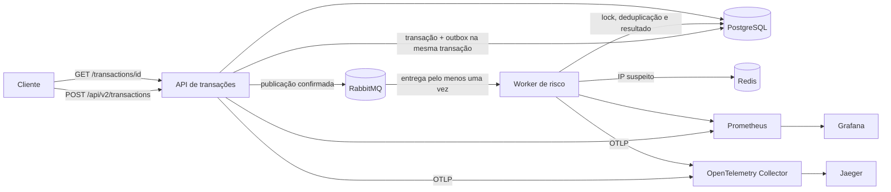

# Sentinela

Sentinela demonstra um fluxo assíncrono de análise de risco com API de transações, worker de risco, PostgreSQL, RabbitMQ, Redis e observabilidade local. API e worker são processos independentes do mesmo artefato Spring Boot, selecionados pelo perfil `api` ou `worker`.

## Arquitetura



O POST retorna `202 Accepted` assim que a transação e o evento de outbox são persistidos. O publicador reivindica lotes usando locks `SKIP LOCKED` com lease, encerra a transação do banco antes de aguardar o RabbitMQ e grava a confirmação depois. Se cair antes de concluir, o lease expira e o evento pode ser publicado novamente; o worker usa lock de linha e estado persistido para tornar reentregas inofensivas.

## Executar localmente

É necessário Docker com Docker Compose:

```bash
docker compose --profile app up --build
```

O Compose inicia PostgreSQL, RabbitMQ, Redis, API, worker, Prometheus, Grafana, Jaeger e OpenTelemetry Collector. As portas publicadas ficam vinculadas a `127.0.0.1`. Os valores padrão são somente para desenvolvimento local; configure segredos próprios fora desse cenário.

A API exige HTTP Basic e associa cada transação ao usuário autenticado. Defina `API_USERNAME` e `API_PASSWORD` para um cliente ou `API_CLIENTS_JSON` para cadastrar vários clientes, por exemplo `{"cliente-a":"segredo-a","cliente-b":"segredo-b"}`. O verificador usa BCrypt e não grava credenciais no banco. O endpoint retorna `404` se o cliente autenticado tentar consultar uma transação de outro cliente; a chave de idempotência é única por cliente.

A migração V4 atribui registros existentes ao proprietário `legacy`, pois o sistema anterior não guardava essa informação. Antes de migrar dados de produção, mapeie cada registro ao cliente correto; não dê acesso à identidade `legacy` sem revisar esse mapeamento.

Enviar uma transação:

```bash
curl -i http://localhost:8080/api/v2/transactions \
  -u demo-client:local-demo-change-this \
  -H 'Content-Type: application/json' \
  -H 'Idempotency-Key: pedido-123-tentativa-1' \
  -d '{"transactionId":"TXN001","userId":"USER123","amount":9500.00,"country":"NG","ipAddress":"192.168.1.100","cardAttempts":5,"emailAgeDays":2}'
```

O mesmo `Idempotency-Key` e o mesmo corpo retornam a transação já criada sem gravar outro evento. Reutilizar a chave com outro corpo retorna `409 Conflict`. A resposta inicial inclui `status: PENDING` e um cabeçalho `Location`.

Consultar o resultado:

```bash
curl -u demo-client:local-demo-change-this http://localhost:8080/api/v2/transactions/TXN001
```

O worker aplica as regras: valor acima de BRL 5.000 (+40), país diferente de BR (+20), três ou mais tentativas (+25), e-mail com menos de sete dias (+30), e IP listado no Redis (+50). O score fica entre 0 e 100. Redis é uma fonte auxiliar; se estiver indisponível, a análise continua sem o sinal de IP e incrementa `sentinela.redis.failures`.

Para registrar um IP de teste na lista do Redis:

```bash
docker compose exec redis redis-cli SADD sentinela:suspicious-ips 203.0.113.10
```

## Filas e falhas

- Fila de análise durável: `sentinela.risk.analysis`.
- Retentativas locais: três retentativas com backoff exponencial após a entrega inicial.
- Falhas persistentes são rejeitadas para a DLQ `sentinela.risk.analysis.dlq`.
- A API consome a DLQ e move a transação de `PENDING` para `FAILED`; o endpoint de status expõe o motivo terminal.
- A fila de outbox é armazenada no PostgreSQL, junto da transação, e marcada como publicada após confirmação do RabbitMQ.
- Reivindicações do outbox expiram após dois minutos se o publicador parar antes de concluir.
- O status `COMPLETED` e o lock pessimista por transação impedem aplicar efeitos duas vezes em mensagens repetidas ou concorrentes.

O painel de gerenciamento do RabbitMQ em `http://localhost:15672` usa `sentinela` / `local-rabbit-secret` por padrão neste ambiente local. A mensagem da DLQ pode ser inspecionada pelo painel.

## Observabilidade e carga

- Prometheus: `http://localhost:9090`.
- Grafana: `http://localhost:3000` (`admin` / `local-grafana-secret`, somente local).
- Jaeger: `http://localhost:16686`.
- Métricas Actuator/Prometheus: porta de gerenciamento `8081` na API e `8082` no host para o worker.
- Traces OTLP passam pelo Collector e chegam ao Jaeger.
- Logs de console são JSON estruturado. Métricas próprias incluem total e duração do processamento de mensagens, com rótulos de resultado de baixa cardinalidade.

Executar o cenário k6:

```bash
docker compose --profile app --profile load-test run --rm k6
```

O cenário usa as credenciais locais do Compose, gera IDs exclusivos por execução e mede a latência da submissão HTTP (não o tempo até a análise terminar). Ele falha se erros excederem 1%, p95 exceder 1 s ou p99 exceder 2 s. Para outro ambiente, defina `API_USERNAME`, `API_PASSWORD` e `RUN_ID`; não passe credenciais de produção na linha de comando. Ainda não há números de throughput ou p95 publicados: o benchmark deve ser executado em ambiente controlado antes de documentar qualquer comparação.

O Prometheus avalia alertas para indisponibilidade dos alvos, taxa de HTTP 5xx e acúmulo do outbox. A configuração é um ponto inicial para ambiente local; alertas operacionais exigem um Alertmanager e um destino de notificação configurados pelo operador.

## Testes e CI

```bash
./mvnw test
```

No Windows: `mvnw.cmd verify`. O GitHub Actions executa `clean verify`, gera relatório JaCoCo e constrói a imagem Docker.

Os testes rápidos usam H2. `DistributedFlowIntegrationTests` usa Testcontainers com PostgreSQL e RabbitMQ para validar as migrações, claims concorrentes, publicação, retries e DLQ; execute `mvnw verify` com Docker disponível para incluí-los. Sem um runtime Docker, esses testes são ignorados. O relatório JaCoCo é gerado em `target/site/jacoco/index.html`.

## Decisões e limites conhecidos

As decisões estão em [`docs/adr`](docs/adr): RabbitMQ foi escolhido para execução local simples com DLQ; PostgreSQL é a fonte de verdade transacional; Redis guarda o conjunto auxiliar de IPs; Prometheus e OTLP/Jaeger dão visibilidade local ao fluxo. Os ADRs 0005 e 0006 registram por que NoSQL e IA dependem de medições e dados representativos antes de serem adicionados. O schema principal é evoluído com Flyway em `src/main/resources/db/migration`; Hibernate valida o schema em vez de alterá-lo automaticamente. A autenticação da API usa HTTP Basic sem sessão; em produção, publique-a somente atrás de TLS e injete os segredos por um gerenciador apropriado. Não exponha a porta de gerenciamento ou o endpoint Prometheus à internet.

API e worker são executáveis separados, mas ainda compartilham o mesmo esquema PostgreSQL e o mesmo artefato. Isso deixa o projeto fácil de rodar e demonstra o fluxo distribuído sem simular independência de dados que ainda não existe. O próximo passo arquitetural é separar a propriedade dos dados e publicar um evento de conclusão para a API. Terraform/AWS, Kubernetes, banco NoSQL e um modelo de IA ficam para etapas futuras; nenhum custo, ganho de desempenho ou cobertura é alegado sem medição.
