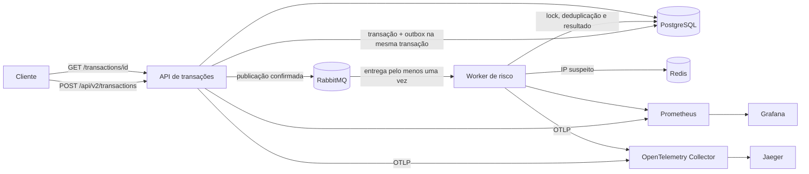

# Sentinela

Sentinela demonstra um fluxo assíncrono de análise de risco com API de transações, worker de risco, PostgreSQL, RabbitMQ, Redis e observabilidade local. API e worker são processos independentes do mesmo artefato Spring Boot, selecionados pelo perfil `api` ou `worker`.

## Arquitetura



O POST retorna `202 Accepted` assim que a transação e o evento de outbox são persistidos. O publicador envia eventos pendentes ao RabbitMQ e espera a confirmação do broker. O worker calcula o risco e atualiza o estado no PostgreSQL; o cliente consulta o resultado pelo endpoint de status. O outbox cobre a falha entre persistir a transação e publicar a mensagem. Confirmações podem ser repetidas após falhas, portanto o worker usa lock de linha e estado persistido para tornar reentregas inofensivas.

## Executar localmente

É necessário Docker com Docker Compose:

```bash
docker compose --profile app up --build
```

O Compose inicia PostgreSQL, RabbitMQ, Redis, API, worker, Prometheus, Grafana, Jaeger e OpenTelemetry Collector. As credenciais do Compose são apenas para desenvolvimento local; não use esses valores fora da máquina local.

Enviar uma transação:

```bash
curl -i http://localhost:8080/api/v2/transactions \
  -H 'Content-Type: application/json' \
  -H 'Idempotency-Key: pedido-123-tentativa-1' \
  -d '{"transactionId":"TXN001","userId":"USER123","amount":9500.00,"country":"NG","ipAddress":"192.168.1.100","cardAttempts":5,"emailAgeDays":2}'
```

O mesmo `Idempotency-Key` e o mesmo corpo retornam a transação já criada sem gravar outro evento. Reutilizar a chave com outro corpo retorna `409 Conflict`. A resposta inicial inclui `status: PENDING` e um cabeçalho `Location`.

Consultar o resultado:

```bash
curl http://localhost:8080/api/v2/transactions/TXN001
```

O worker aplica as regras: valor acima de BRL 5.000 (+40), país diferente de BR (+20), três ou mais tentativas (+25), e-mail com menos de sete dias (+30), e IP listado no Redis (+50). O score fica entre 0 e 100. Redis é uma fonte auxiliar; se estiver indisponível, a análise continua sem o sinal de IP e incrementa `sentinela.redis.failures`.

Para registrar um IP de teste na lista do Redis:

```bash
docker compose exec redis redis-cli SADD sentinela:suspicious-ips 203.0.113.10
```

## Filas e falhas

- Fila de análise durável: `sentinela.risk.analysis`.
- Retentativas locais: três retentativas com backoff exponencial após a entrega inicial.
- Falhas persistentes são rejeitadas para a DLQ `sentinela.risk.analysis.dlq`.
- A fila de outbox é armazenada no PostgreSQL, junto da transação, e marcada como publicada após confirmação do RabbitMQ.
- O status `COMPLETED` e o lock pessimista por transação impedem aplicar efeitos duas vezes em mensagens repetidas ou concorrentes.

O painel de gerenciamento do RabbitMQ em `http://localhost:15672` usa `sentinela` / `sentinela` neste ambiente local. A mensagem da DLQ pode ser inspecionada pelo painel.

## Observabilidade e carga

- Prometheus: `http://localhost:9090`.
- Grafana: `http://localhost:3000` (`admin` / `admin`, somente local).
- Jaeger: `http://localhost:16686`.
- Métricas Actuator/Prometheus: porta de gerenciamento `8081` na API e `8082` no host para o worker.
- Traces OTLP passam pelo Collector e chegam ao Jaeger.
- Logs de console são JSON estruturado. Métricas próprias incluem total e duração do processamento de mensagens, com rótulos de resultado de baixa cardinalidade.

Executar o cenário k6:

```bash
docker compose --profile app --profile load-test run --rm k6
```

O script registra taxa de falhas e latência da submissão assíncrona. Ainda não há números de throughput ou p95 publicados: o benchmark deve ser executado em ambiente controlado antes de documentar qualquer comparação.

## Testes e CI

```bash
./mvnw test
```

No Windows: `mvnw.cmd test`. Os testes de integração usam H2 para verificar idempotência, outbox, validação e reentrega sem depender de containers. O GitHub Actions executa `clean verify`, gera relatório JaCoCo e constrói a imagem Docker.

Na última execução local de `clean verify` (7 de outubro de 2026), o JaCoCo mediu 73% de cobertura de instruções e 46% de branches; foram executados seis testes. O relatório HTML é gerado em `target/site/jacoco/index.html`.

## Decisões e limites conhecidos

As decisões estão em [`docs/adr`](docs/adr): RabbitMQ foi escolhido para execução local simples com DLQ; PostgreSQL é a fonte de verdade transacional; Redis guarda o conjunto auxiliar de IPs; Prometheus e OTLP/Jaeger dão visibilidade local ao fluxo.

API e worker são executáveis separados, mas ainda compartilham o mesmo esquema PostgreSQL e o mesmo artefato. Isso deixa o projeto fácil de rodar e demonstra o fluxo distribuído sem simular independência de dados que ainda não existe. O próximo passo arquitetural é separar a propriedade dos dados e publicar um evento de conclusão para a API. Terraform/AWS, Kubernetes, banco NoSQL e um modelo de IA ficam para etapas futuras; nenhum custo, ganho de desempenho ou cobertura é alegado sem medição.
